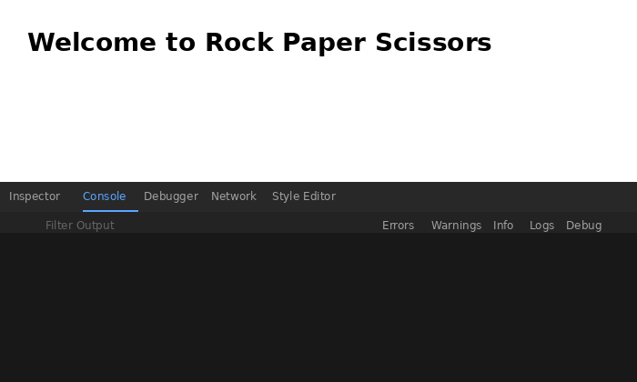

# Rock Paper Scissors 

My first JavaScript project built as part of [The Odin Project](https://www.theodinproject.com/) Foundations course.

## About

This project focuses on using JavaScript basic syntax and writing algorithms. The goal is to let the user guess the choice to match the computer's five random choices. Each guess is newly generated by the computer.

## What I Learned

This project taught me JavaScript fundamentals including functions, conditionals, and `Math.random()`. I practiced writing game logic algorithms and handling user input through the console.

## Live Demo
[View Live Demo](https://skipididev.github.io/rock-paper-scissors/)

## Technologies
- HTML
- JavaScript
